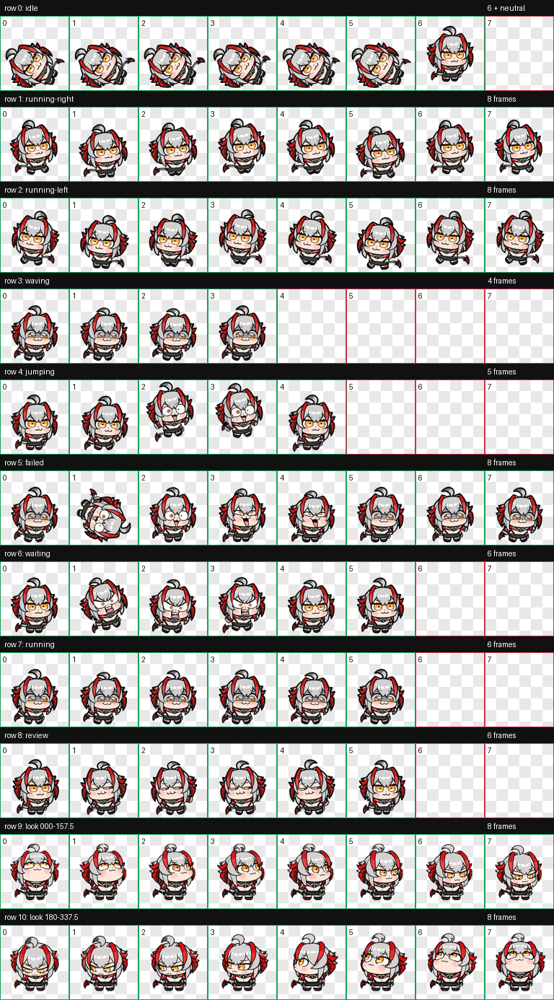
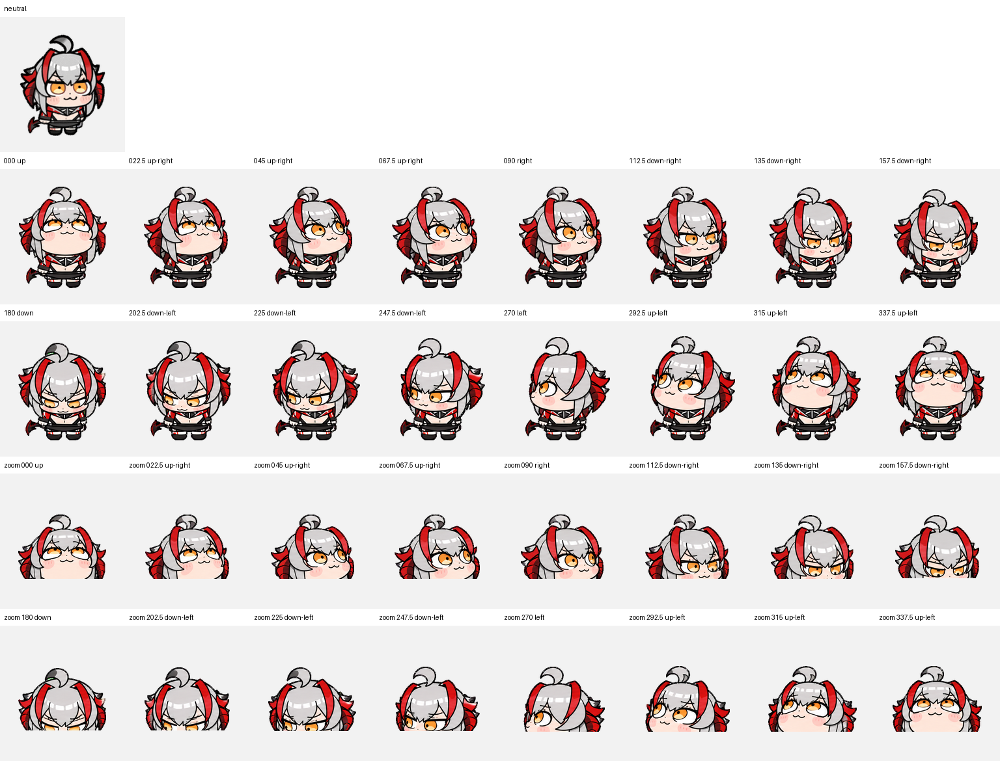

# 动画帧与图片索引

每张 PNG 是透明背景的 **192×208** 画格，路径中的数字从 `000.png` 开始。原 GIF 保存在 [`../stickers/`](../stickers/)，v2 图集在 [`../pets/wisadel-rest/`](../pets/wisadel-rest/)。下表的“逐帧 PNG”是不同的姿势或位置画格数，不等于 APNG 的 35 ms 时间步长数。

| Codex 状态 | 逐帧 PNG | 原始素材 | 说明 |
| --- | ---: | --- | --- |
| `idle` | [19](../frames/native/idle_rest/) | `待机休息1.gif` | 当前 v2 宠物的待机来源 |
| `running-right` | [14](../frames/native/running-right/) | `移动.gif` | 向右拖动 |
| `running-left` | [14](../frames/native/running-left/) | `移动.gif` | 逐帧水平镜像 |
| `waving` | [38](../frames/native/waving/) | `刚开始任务、鼠标放置在宠物上.gif` | 开始/挥手 |
| `jumping` | [15](../frames/native/jumping/) | `点击宠物.gif` | 5 幅原画 + 10 幅位置补帧 |
| `failed` | [35](../frames/native/failed/) | `发癫（5小时token少于20%或者周额度剩余少于10%）.gif` | 失败/低额度表情素材 |
| `waiting` | [30](../frames/native/waiting/) | `如果需要我进行有关任务的问题回答（单选、多选等）.gif` | 等待回答 |
| `running` | [38](../frames/native/running/) | `刚开始任务、鼠标放置在宠物上.gif` | 任务进行中使用的原画 |
| `review` | [32](../frames/native/review/) | `任务已经完成了.gif` | 完成/复查 |

上述标准动作共 **235 张 PNG**。另有 [16 张视线方向 PNG](../frames/look-directions/)：`000`, `022.5`, `045`, `067.5`, `090`, `112.5`, `135`, `157.5`, `180`, `202.5`, `225`, `247.5`, `270`, `292.5`, `315`, `337.5` 度。`000` 是向上，不是正面中立姿态。所有逐帧图合计 **251 张**。

更细的来源、循环周期和原画帧数见 [`motion-sources.json`](motion-sources.json)。图集会把动作帧映射到共享 APNG 时间轴；不要把表中的 PNG 数量误写成客户端每秒播放帧率。
